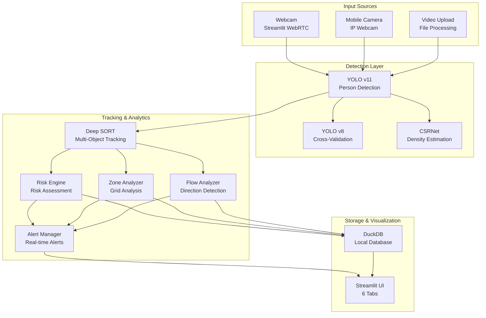

# 🎥 Intelligent Crowd Surveillance System (ICSS)

A comprehensive real-time crowd monitoring and analysis system powered by AI/ML for intelligent surveillance, risk assessment, and crowd management.

**🔗 Live Demo**: [ICSS](https://icss2026vps.streamlit.app/)

---

## 📋 Table of Contents

- [Overview](#overview)
- [Features](#features)
- [Tech Stack](#tech-stack)
- [System Architecture](#system-architecture)
- [Project Structure](#project-structure)
- [Installation](#installation)
- [How to Run](#how-to-run)
- [User Interface](#user-interface)
- [Configuration](#configuration)
- [Dense Crowd Detection](#dense-crowd-detection)
- [Performance](#performance)
- [Troubleshooting](#troubleshooting)
- [Dependencies](#dependencies)

---

## Overview

**Intelligent Crowd Surveillance System** is a real-time computer vision application designed for intelligent crowd monitoring, density estimation, and risk assessment. It combines multiple AI models (YOLO, CSRNet) for enhanced detection accuracy in both normal and dense crowd scenarios.

### Key Highlights
- 🎯 **Dual YOLO Model System** - YOLO v11 + YOLO v8 for cross-validation
- 📱 **Mobile Camera Support** - IP Webcam integration for flexible positioning
- 🧪 **Dense Crowd Detection** - Enhanced detection for crowded scenes
- 📊 **Density Estimation** - CSRNet neural network for heatmap generation
- 🗺️ **Zone-based Analysis** - Grid-based risk highlighting
- 🧠 **Advanced Analytics** - Intelligent risk assessment, flow analysis
- 💾 **Local Storage** - DuckDB for offline analytics
- 🚨 **Real-time Alerts** - Alert manager with sound notifications

---

## Features

### Core Detection Features
- **Person Detection**: High-precision YOLO v11/v8 models
- **Crowd Counting**: Real-time people counting
- **Density Estimation**: Normalized people per pixel area
- **Movement Tracking**: Deep SORT multi-object tracking
- **Flow Analysis**: Direction detection (Left/Right/Up/Down/Mixed)
- **Risk Assessment**: 3-tier classification (Normal/Average/Risky)

### Input Sources
- **Webcam (Live)**: Real-time camera feed via Streamlit WebRTC
- **Mobile Camera (IP Webcam)**: WiFi streaming from mobile device
- **Video Upload**: Process pre-recorded video files

### Dense Crowd Detection
- **CSRNet Density Maps**: Neural network-based density heatmap generation
- **Zone Grid Highlighting**: Color-coded risk zones (Green/Yellow/Red)
- **Enhanced Detection**: Optimized detection for crowded scenes

### Alert System
- **Real-time Alerts**: Automatic risk detection and notification
- **Sound Notifications**: Audio alerts for critical events
- **Alert History**: Track and manage alert events
- **Severity Levels**: INFO, WARNING, CRITICAL classifications

### Advanced Analytics
- **Smart Risk Engine**: Weighted risk scoring (density, flow conflict, speed)
- **Zone Monitoring**: Grid-based area analysis with overcrowding alerts
- **Flow Pattern Detection**: Bidirectional conflict and surge detection
- **Speed Estimation**: Real-time velocity calculations

### User Interface
- **Tabbed Interface**: Live Feed, Analytics, Map Area, Local DB, Controls, Alerts
- **Real-time Overlays**: Bounding boxes, heatmaps, zone boundaries
- **Configurable Settings**: Thresholds, weights, grid sizes
- **Data Export**: Download analytics data
- **Mobile Camera Controls**: Sidebar configuration for IP Webcam

---

## Tech Stack

| Category | Technologies |
|----------|-------------|
| **Frontend** | Streamlit, Streamlit WebRTC |
| **Computer Vision** | OpenCV, YOLO v11, YOLO v8 |
| **AI/ML** | PyTorch, Ultralytics, CSRNet |
| **Tracking** | Deep SORT |
| **Database** | DuckDB (local analytics) |
| **Video Processing** | PyAV (av library) |
| **Visualization** | Plotly, Matplotlib, Seaborn |
| **Data Processing** | NumPy, Pandas, SciPy |

---

## System Architecture



### Architecture Overview

1. **Input Layer**: Multiple input sources (Webcam, Mobile Camera via IP Webcam, Video Upload)
2. **Detection Layer**: Dual YOLO models (v11 + v8) for person detection, CSRNet for dense crowd density estimation
3. **Tracking & Analytics Layer**: Deep SORT for tracking, Risk Engine for assessment, Zone/Flow analyzers for spatial analysis
4. **Alert System**: Real-time alert manager with severity levels and sound notifications
5. **Storage Layer**: DuckDB for offline analytics and historical data
6. **Visualization Layer**: Streamlit UI with 6 tabs for comprehensive monitoring

---

## Project Structure

```
ICSS
├── app.py                      # Main Streamlit application
├── camera1.py                  # Mobile camera streaming (IP Webcam)
├── requirements.txt            # Python dependencies
├── README.md                   # Project documentation
├── crowd_data.db               # DuckDB local database
│
├── model/                      # AI model files
│   ├── yolo11l.pt                  # YOLO v11 (51MB)
│   └── V8l-haj.pt              # YOLO v8 (87MB)
│
├── utils/                      # Utility modules
│   ├── detection.py            # Detection pipeline
│   ├── tracker.py              # Deep SORT tracking
│   ├── advanced_analytics.py   # Analytics integration
│   ├── risk_engine.py          # Risk assessment
│   ├── zone_analyzer.py        # Zone monitoring
│   ├── flow_analyzer.py        # Flow analysis
│   ├── csrnet_density.py       # CSRNet density estimation
│   ├── crowd_visualization.py  # Visualization components
│   ├── crowd_analytics.py      # Crowd behavior analysis
│   └── alert_manager.py        # Real-time alert system
```

---

## Installation

### Prerequisites
- Python 3.8 or higher
- Webcam or video files for testing
- (Optional) NVIDIA GPU for faster inference

### Step 1: Clone/Download Project

```bash
git clone  https://github.com/SURIYA-PRAKASH-E-S/ICSS.git 
cd ICSS
```

### Step 2: Create Virtual Environment

```bash
# Create virtual environment
python -3.10 -m venv venv

# Activate virtual environment
# Windows:
venv\Scripts\activate
# Linux/macOS:
source venv/bin/activate
```

### Step 3: Install Dependencies

```bash
pip install -r requirements.txt
```

### Dependencies List
```
streamlit
streamlit-webrtc
opencv-python
ultralytics
numpy
av
duckdb
plotly
pandas
torch
torchvision
scipy
scikit-learn
matplotlib
seaborn
```

### Step 4: Verify Models

Ensure YOLO models are in the `model/` directory:
- `model/yolo11l.pt` (51MB)
- `model/V8l-haj.pt` (87MB)

---

## How to Run

### Start the Application

```bash
streamlit run app.py
```

### Access the Application

After running, you'll see:

```
You can now view your Streamlit app in your browser.

Local URL: http://localhost:8501
Network URL: http://192.168.1.4:8501
```

Open **http://localhost:8501** in your browser.

### Quick Start Guide

1. **Select Input Mode** (Tab 1: Live Feed)
   - Choose "Webcam (Live)" for real-time camera feed
   - Choose "Mobile Camera (IP Webcam)" for WiFi streaming from phone
   - Or "Upload Video" to process a video file

2. **Start Processing**
   - Click "Start" to begin video processing
   - View real-time detections and overlays

3. **Monitor Analytics** (Tab 2: Analytics)
   - View people count, density, flow direction
   - Check risk level and alerts

4. **View Zone Analysis** (Tab 3: Map Area)
   - Visualize zone-based risk distribution
   - Monitor overcrowded areas

5. **View Historical Data** (Tab 4: Local DB)
   - Check stored analytics from DuckDB
   - View trends and statistics

6. **Configure Settings** (Tab 5: Controls)
   - Enable/disable detection features
   - Adjust thresholds and parameters

7. **Manage Alerts** (Tab 6: Alerts)
   - View active and historical alerts
   - Configure alert thresholds

---

## User Interface

### Tab 1: 🎥 Live Feed

| Feature | Description |
|---------|-------------|
| Input Selection | Webcam, Mobile Camera (IP Webcam), or Video Upload |
| Real-time Processing | Live video with AI overlays |
| Performance Info | FPS, model status, optimization mode |
| Visual Overlays | Bounding boxes, risk levels, flow arrows |
| Alert System | Color-coded risk warnings |

### Tab 2: 📊 Analytics

| Feature | Description |
|---------|-------------|
| Real-time Metrics | People count, density, flow, risk |
| Advanced Analytics | Risk engine, zone analysis, flow patterns |
| Risk Assessment | Color-coded indicators and alerts |
| Model Performance | Detection statistics and model status |

### Tab 3: Map Area

| Feature | Description |
|---------|-------------|
| Zone Grid | Visual representation of risk zones |
| Zone Details | Per-zone people count and density |
| Zone Alerts | Overcrowding and violation warnings |

### Tab 4: 📂 Local DB

| Feature | Description |
|---------|-------------|
| Current Metrics | Latest database values |
| Historical Trends | Last 10 records table |
| Statistics | Average values and risk distribution |
| Database Info | Record count and storage details |

### Tab 5: ⚙️ Controls

| Feature | Description |
|---------|-------------|
| Model Selection | YOLO v11/v8 toggle |
| Deep SORT Toggle | Multi-object tracking control |
| Advanced Analytics | Risk, zone, flow analysis toggles |
| Dense Crowd Detection | CSRNet settings |
| Threshold Settings | Density and count risk levels |
| Risk Weights | Configurable assessment parameters |
| Zone Configuration | Grid size and restricted zones |
| Mobile Camera | IP Webcam connection settings |

### Tab 6: 🚨 Alerts

| Feature | Description |
|---------|-------------|
| Active Alerts | Current critical and warning alerts |
| Alert History | Past alert events log |
| Alert Configuration | Threshold settings for different severity levels |

---

## Configuration

### Detection Thresholds

| Parameter | Default | Description |
|-----------|---------|-------------|
| Low Density Threshold | 0.5 | Triggers "Average" risk |
| Medium Density Threshold | 1.0 | Triggers "Risky" risk |
| People Count Threshold | 8 | Number for "Risky" level |

### Risk Engine Weights

| Weight | Default | Description |
|--------|---------|-------------|
| Density Weight | 0.40 | Crowd density factor |
| Flow Conflict Weight | 0.35 | Bidirectional flow factor |
| Speed Variation Weight | 0.25 | Velocity variation factor |

### Dense Crowd Detection Settings

| Setting | Default | Description |
|---------|---------|-------------|
| CSRNet Enabled | True | Density heatmap generation |
| Density Heatmap | True | Overlay heatmap on video |
| Zone Grid | True | Color-coded risk zones |
| Grid Size | 4x4 | Zone grid dimensions |

### Deep SORT Parameters

| Parameter | Default | Description |
|-----------|---------|-------------|
| Max Age | 30 | Track persistence (frames) |
| N Init | 5 | Track confirmation threshold |
| NMS Max Overlap | 0.3 | Detection overlap threshold |

---

## Mobile Camera Setup

### IP Webcam App Configuration

1. **Install IP Webcam App**
   - Android: Download "IP Webcam" from Google Play Store
   - iOS: Download "IP Webcam" from App Store

2. **Configure IP Webcam Settings**
   - Open the IP Webcam app on your phone
   - Navigate to "Settings" or "Preferences"
   - Set the following:
     - **Username/Password**: (Optional) Set authentication if needed
     - **Resolution**: 640x480 or higher
     - **FPS**: 30 or higher
     - **Port**: 8080 (default)

3. **Start IP Webcam Server**
   - Tap "Start Server" in the app
   - Note the IP address shown (e.g., 192.168.1.5:8080)
   - Ensure your phone and computer are on the same WiFi network

4. **Connect in Application**
   - Go to the sidebar in the app
   - Find "Mobile Camera" section
   - Enter the IP address from step 3
   - Click "Connect"
   - Select "Mobile Camera (IP Webcam)" in the Live Feed tab

### Troubleshooting Mobile Camera

| Issue | Solution |
|-------|----------|
| Connection failed | Check phone and PC are on same WiFi |
| Black screen | Try different stream URL in settings |
| Laggy feed | Reduce resolution or FPS in IP Webcam app |
| Authentication error | Enter username/password if set in app |

---

## Dense Crowd Detection

### CSRNet Density Estimation

**Purpose**: Generate density heatmaps and estimate crowd count from density maps.

**How it works**:
1. Processes frame through CSRNet neural network
2. Generates density map (probability distribution)
3. Estimates total crowd count from density map
4. Creates colored heatmap visualization

**Fallback**: Detection-based density estimation if CSRNet unavailable.

### Zone-based Risk Highlighting

**Purpose**: Divide frame into grid zones and classify risk per zone.

**Zone Classification**:
| Color | Risk Level | Density Range |
|-------|------------|---------------|
| 🟢 Green | Low | < 0.3 |
| 🟡 Yellow | Medium | 0.3 - 0.6 |
| 🔴 Red | High | > 0.6 |

**Visualization**:
- Zone boundaries with color-coded borders
- Semi-transparent zone fill
- Zone density labels
- Risk legend overlay

---

## Performance

### Processing Speed

| Mode | Frame Rate | Description |
|------|------------|-------------|
| Optimized Mode | ~10 FPS | Frame skipping (1/3 frames) |
| Fast Mode | ~15 FPS | No Deep SORT tracking |
| Dense Detection | ~8 FPS | CSRNet enabled |

### Model Performance

| Model | Size | Accuracy | Speed |
|-------|------|----------|-------|
| YOLO v11 | 51MB | High | Fast |
| YOLO v8 | 87MB | Good | Medium |

### Optimization Features

- **Frame Skipping**: Process every 3rd frame
- **Resolution Scaling**: Adaptive 640x480 target
- **Cached Model Loading**: @st.cache_resource
- **Non-blocking Database**: Async DuckDB inserts

---

## Troubleshooting

### Common Issues

#### 1. Model Loading Errors

**Solution**: 
- Verify model files exist in `model/` directory
- Check file sizes match expected (51MB, 87MB)
- Re-download models if corrupted

#### 2. Webcam Not Working

**Solution**: 
- Check webcam permissions
- Try different browser (Chrome recommended)
- Verify webcam is not used by another application

#### 3. Low FPS / Slow Processing

**Solutions**:
- Disable Deep SORT tracking
- Use single model (YOLO v11 only)
- Disable CSRNet
- Reduce frame resolution

#### 4. "Thread 'async_media_processor' missing ScriptRunContext"

**Solution**: This warning can be ignored - it's expected behavior in async video processing.

#### 5. DuckDB Errors

**Solution**: 
- Check `crowd_data.db` file permissions
- Delete `crowd_data.db` and restart app (will recreate)

---

## Dependencies

### Core Dependencies

```
streamlit>=1.28.0
streamlit-webrtc>=1.0.0
opencv-python>=4.8.0
ultralytics>=8.0.0
numpy>=1.24.0
av>=10.0.0
duckdb>=0.9.0
plotly>=5.15.0
pandas>=2.0.0
```

### Dense Crowd Detection Dependencies

```
torch>=2.0.0
torchvision>=0.15.0
scipy>=1.10.0
scikit-learn>=1.2.0
matplotlib>=3.7.0
seaborn>=0.12.0
```

### Mobile Camera Dependencies

```
opencv-python>=4.8.0
```

### Optional Dependencies

```
deep-sort-realtime  # For Deep SORT tracking
```

---

## Risk Classification

| Level | Color | Condition | Action |
|-------|-------|-----------|--------|
| **Normal** | 🟢 Green | Low density, safe conditions | No action required |
| **Average** | 🟡 Yellow | Moderate density | Monitor closely |
| **Risky** | 🔴 Red | High density or overcrowding | Immediate attention |

---

## Model Information

### YOLO v11 (Primary)
- **File**: `model/yolo11l.pt`
- **Size**: 51MB
- **Version**: Latest
- **Accuracy**: High
- **Use Case**: General crowd detection

### YOLO v8 (Secondary)
- **File**: `model/V8l-haj.pt`
- **Size**: 87MB
- **Version**: Legacy
- **Accuracy**: Good
- **Use Case**: Cross-validation, backup

---

## Data Storage

### DuckDB Database

- **File**: `crowd_data.db`
- **Type**: Local analytical database
- **Schema**:

```sql
CREATE TABLE crowd_metrics (
    timestamp TIMESTAMP DEFAULT CURRENT_TIMESTAMP,
    people_count INTEGER,
    density FLOAT,
    flow_direction VARCHAR,
    risk_level VARCHAR
);
```

### Data Operations

- **Insert**: Every processed frame
- **Query**: Last 10 records for trends
- **Statistics**: Average values, risk distribution

---

## Support

For issues or questions:
1. Check [Troubleshooting](#troubleshooting) section
2. Verify all dependencies are installed
3. Check model files exist
4. Review console output for errors

---

## License

This project is for educational and research purposes.

---

**Built with ❤️ using Streamlit, YOLO, PyTorch, and OpenCV**